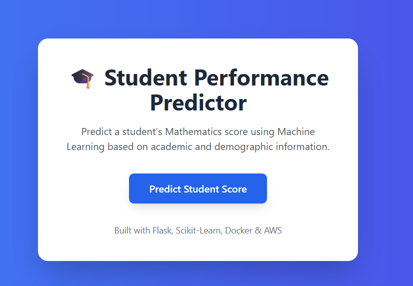
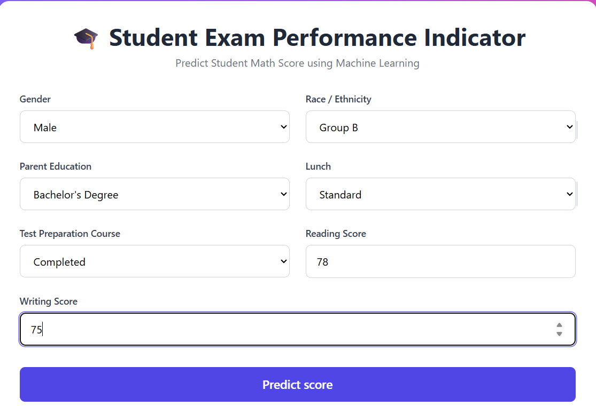

# Student Performance Prediction System
## Live Demo

Application URL:

https://your-app-domain.com

---

## AWS Deployment

Deployed using:

* AWS Elastic Beanstalk
* AWS ECR (Elastic Container Registry)
* AWS CodePipeline

Deployment URL:

http://your-elasticbeanstalk-url.us-east-1.elasticbeanstalk.com

---

## Source Code

GitHub Repository:

https://github.com/israr-ai/ml-pipeline-project

---

## Screenshots

### Home Page



### Prediction Page



### Prediction Result


## Project Overview

This project is an end-to-end Machine Learning application that predicts a student's Mathematics score based on demographic and academic factors such as gender, race/ethnicity, parental education level, lunch type, test preparation course, reading score, and writing score.

The project includes data preprocessing, model training, prediction pipeline creation, a Flask web application, Docker containerization, and cloud deployment readiness.

---

## Features

* Student score prediction using Machine Learning
* Data preprocessing and feature engineering
* Flask-based web application
* User-friendly prediction form
* Dockerized application
* Production-ready project structure
* AWS deployment support

---

## Project Structure

```text
mlproject/
│
├── artifacts/
│   ├── model.pkl
│   ├── preprocessor.pkl
│   ├── train.csv
│   ├── test.csv
│   └── data.csv
│
├── notebook/
│   └── project.ipynb
│
├── src/
│   ├── components/
│   ├── pipeline/
│   ├── exception.py
│   ├── logger.py
│   └── utils.py
│
├── templates/
│   ├── index.html
│   └── home.html
│
├── app.py
├── Dockerfile
├── requirements.txt
├── setup.py
└── README.md
```

---

## Dataset Features

The model uses the following input features:

* Gender
* Race/Ethnicity
* Parental Level of Education
* Lunch Type
* Test Preparation Course
* Reading Score
* Writing Score

### Target Variable

* Mathematics Score

---

## Technologies Used

### Programming Language

* Python

### Libraries

* Pandas
* NumPy
* Scikit-Learn
* CatBoost
* Dill

### Web Framework

* Flask

### Containerization

* Docker

### Version Control

* Git & GitHub

### Cloud Deployment

* AWS Elastic Beanstalk
* AWS ECR
* AWS CodePipeline

---

## Machine Learning Workflow

1. Data Ingestion
2. Data Validation
3. Data Transformation
4. Feature Engineering
5. Model Training
6. Model Evaluation
7. Model Serialization
8. Prediction Pipeline
9. Web Application Development
10. Docker Deployment

---

## Installation

### Clone Repository

```bash
git clone <repository-url>
cd mlproject
```

### Create Virtual Environment

```bash
conda create -p venv python=3.11 -y
conda activate venv
```

### Install Dependencies

```bash
pip install -r requirements.txt
```

---

## Run Application Locally

```bash
python app.py
```

Open:

```text
http://localhost:5000
```

---

## Docker Setup

### Build Docker Image

```bash
docker build -t student-performance .
```

### Run Docker Container

```bash
docker run -p 5000:5000 student-performance
```

Open:

```text
http://localhost:5000
```

---

## Model Performance

The model predicts student mathematics scores based on educational and demographic factors.

Evaluation metrics and model comparison were performed during training to select the best-performing model.

---

## Future Improvements

* CI/CD Pipeline Integration
* AWS Cloud Deployment
* User Authentication
* Prediction History Storage
* Monitoring and Logging
* Model Retraining Pipeline

---

## Author

**Israr Shekh**

Full Stack Developer | Data Science & Machine Learning Enthusiast

Skills:

* Python
* Flask
* Machine Learning
* Docker
* AWS
* Laravel
* Power BI

---

## License

This project is developed for educational and portfolio purposes.
